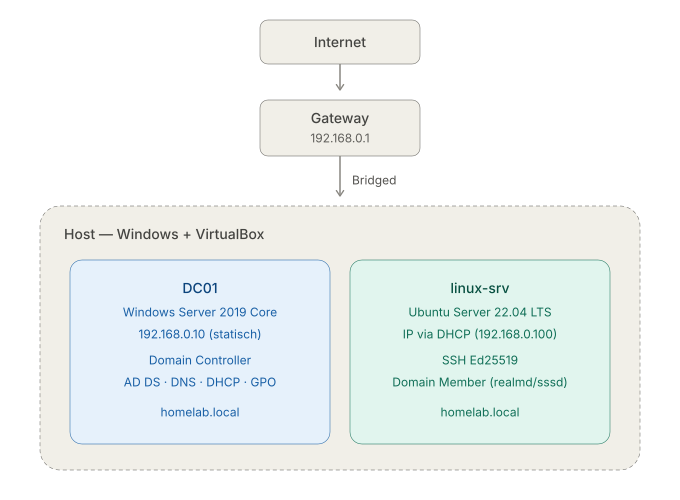

# Homelab — Windows Server & Linux Administration

A self-hosted lab environment for learning and practising IT infrastructure administration.
Built on VirtualBox VMs, documented step-by-step.

---

## Environment

| Component | Details |
|-----------|---------|
| Hypervisor | VirtualBox |
| Network | NAT (college) / Bridged (home) |

## Network Topology



### Virtual Machines

| VM | OS | RAM | Disk | Role |
|----|----|-----|------|------|
| DC01 | Windows Server 2019 (Server Core) | 4 GB | 50 GB | Domain Controller |
| linux-srv | Ubuntu Server 24.04 LTS | 2 GB | 20 GB | Linux server |

---

## Progress

### Windows Server

| Task | Status |
|------|--------|
| Windows Server 2019 installation (Server Core) | ✅ Done |
| Active Directory Domain Services (AD DS) | ✅ Done |
| DNS | ✅ Done |
| DHCP | ✅ Done |
| Group Policy Objects (GPO) | ✅ Done |
| Domain join — Ubuntu | 🔄 In progress |
| Shared folders with access control | 🔄 In progress |

### Linux Server

| Task | Status |
|------|--------|
| Ubuntu Server 24.04 LTS installation | ✅ Done |
| SSH key-based authentication | ✅ Done |
| Domain join (homelab.local) | 🔄 In progress |

---

## Configuration Details

### Active Directory

- **Domain:** `homelab.local`
- **NetBIOS:** `HOMELAB`
- **DC hostname:** `DC01.homelab.local`
- **Functional level:** Windows Server 2016
- Configured entirely via **PowerShell** (Server Core — no GUI)

### DHCP Scope

- **Range:** `192.168.0.100 – 192.168.0.200`
- **Subnet mask:** `255.255.255.0`
- **Default gateway:** `192.168.0.1`
- **DNS:** `192.168.0.10` (DC)
- **Lease duration:** 8 days

### Group Policy Objects

| GPO | Scope | Setting |
|-----|-------|---------|
| Password Policy | Default Domain Policy | Min length: 10, complexity on, max age: 42d |
| Desktop Restrictions | OU=Clients | Disable Control Panel |
| Drive Map | OU=Clients | Map `\\DC01\share` as `Z:` |

### SSH (Ubuntu Server)

- Key type: **Ed25519**
- Key generated on Windows host, public key copied to `~/.ssh/authorized_keys`
- Password authentication: **disabled**
- Result: passwordless SSH login from Windows host confirmed

---

## Troubleshooting Log

### DHCP — Access Denied on Authorization

**Problem:** `Add-DhcpServerInDC` failed with `WIN32 5 / Access Denied`  
**Root cause:** User `admin` was not a member of `Domain Admins`  
**Fix:**
```powershell
Add-ADGroupMember -Identity "Domain Admins" -Members admin
```
Full logoff required for Kerberos token refresh.

---

## Technologies Used

`Windows Server 2019` `Active Directory` `DNS` `DHCP` `GPO` `PowerShell`  
`Ubuntu Server 24.04` `OpenSSH` `VirtualBox` `Networking`

---

## Planned (Phase 2)

- Ubuntu domain join (`homelab.local`)
- Shared folders with AD-based access control
- pfSense/OPNsense — VLAN, NAT, Firewall
- Monitoring: Zabbix or Grafana + Prometheus
- Network topology diagram (Draw.io)
- PowerShell scripts for bulk AD user creation
